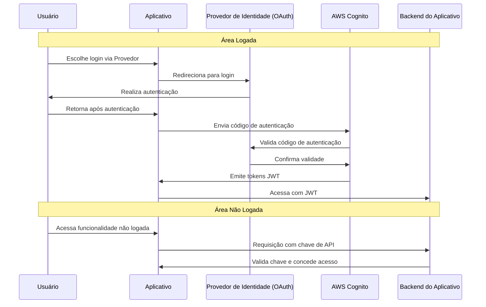

# Sistema de Autenticação do Aplicativo

## Visão Geral

Este documento descreve o sistema de autenticação implementado no aplicativo, que inclui tanto uma área logada quanto uma não logada. Utilizamos o AWS Cognito para gerenciar a autenticação e garantir a segurança dos dados e do acesso do usuário.

## Área Logada

Para os usuários que optam por se logar no aplicativo, utilizamos o protocolo OAuth 2.0 com o AWS Cognito. Isso permite que os usuários se autentiquem usando provedores de identidade populares como Google, Facebook, entre outros.

### Fluxo de Autenticação:

1. O usuário escolhe a opção de login via um provedor de identidade (Google, Facebook, etc.).
2. O aplicativo redireciona o usuário para o provedor de identidade escolhido.
3. Após o login bem-sucedido, o provedor de identidade redireciona de volta para o aplicativo com um código de autenticação.
4. O aplicativo envia este código para o AWS Cognito.
5. O Cognito verifica o código com o provedor de identidade e, se válido, emite tokens JWT para o aplicativo.
6. O aplicativo utiliza esses tokens para autenticações subsequentes e acesso a recursos protegidos.

## Área Não Logada

Usuários na área não logada não precisam se autenticar para acessar certos recursos. No entanto, usamos uma chave de API específica do aplicativo para garantir que apenas o nosso aplicativo possa fazer solicitações ao backend.

### Fluxo de Autenticação:

1. O aplicativo envia solicitações ao backend com a chave de API embutida.
2. O backend valida a chave de API.
3. Se a chave for válida, o acesso aos recursos não protegidos é concedido.

## Diagrama de Sequência

Abaixo está o diagrama de sequência que ilustra os fluxos de autenticação para ambas as áreas, logada e não logada:

