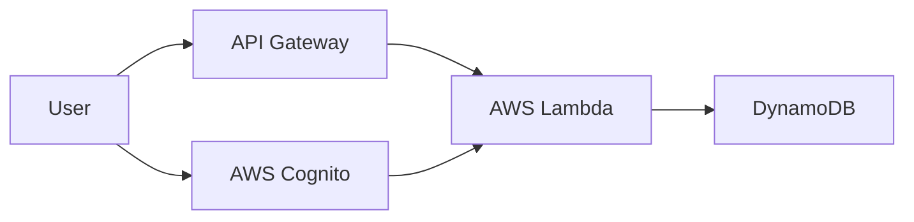
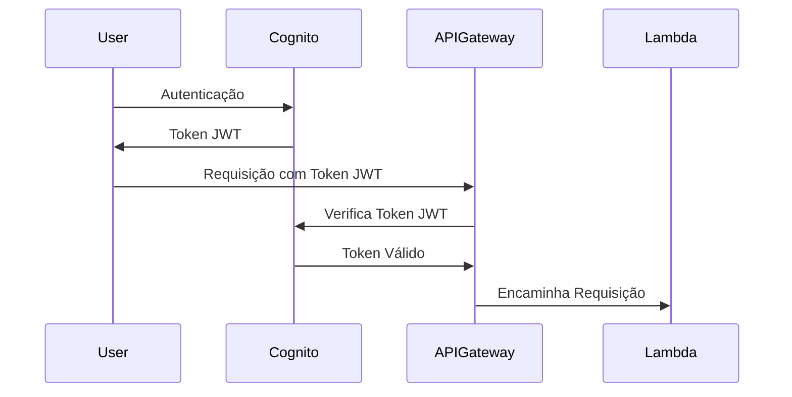
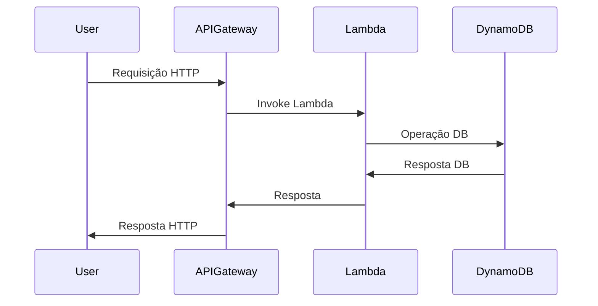

# terraform-aws-serverless-api

Este projeto descreve a infraestrutura como código usando Terraform e Terragrunt para criar uma arquitetura serverless na AWS. Ele inclui AWS Lambda, API Gateway, Cognito para autenticação e DynamoDB como banco de dados NoSQL.

## Dependências
- Terraform >= 0.12.0
- Terragrunt >= 0.19.0
- Configuração da AWS CLI com credenciais de acesso

## Quick Start
Para implantar a infraestrutura:
```bash
cd projeto
terragrunt apply-all
```

Para destruir a infraestrutura:
```bash
cd projeto
terragrunt destroy-all
```

## Arquitetura
A arquitetura inclui os seguintes componentes:
- **AWS Lambda**: Executa o código do backend.
- **API Gateway**: Interface para a aplicação Lambda.
- **AWS Cognito**: Gerencia a autenticação e autorização dos usuários.
- **DynamoDB**: Armazena dados da aplicação.

## Diagramas

Os diagramas a seguir fornecem uma visão geral da infraestrutura e dos fluxos de autenticação.

### Diagrama Geral da Infra


### Fluxo de Autenticação


### Fluxo Completo de uma Requisição


